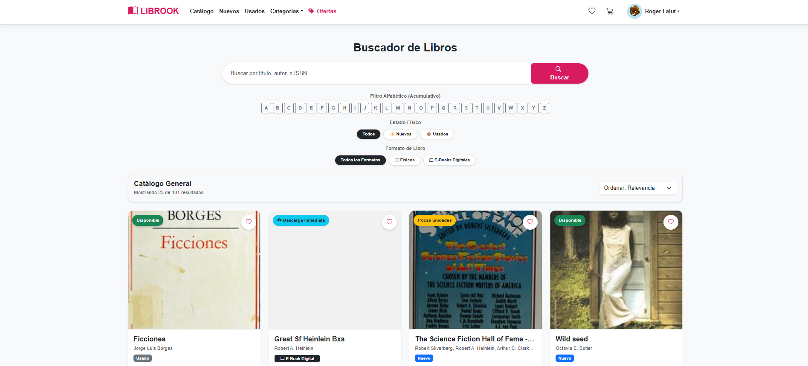
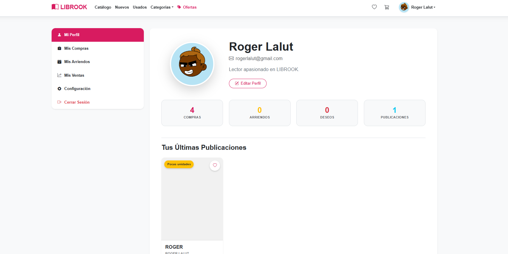
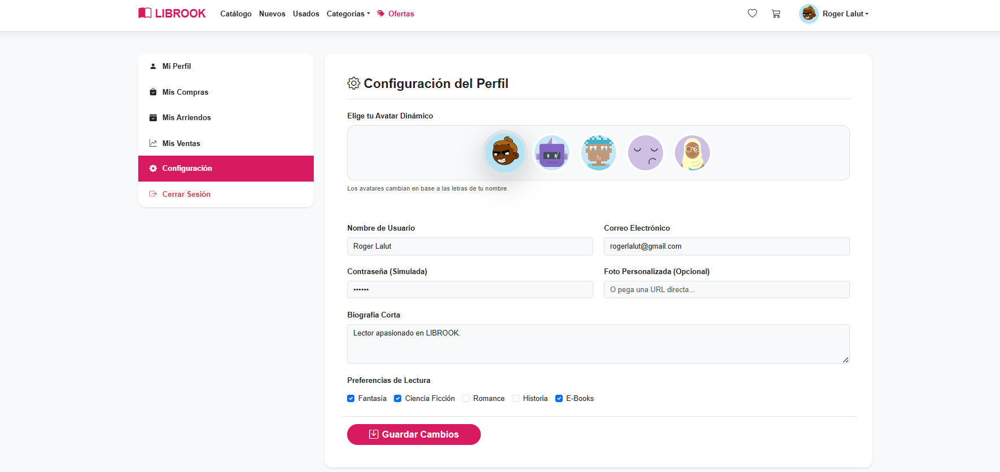
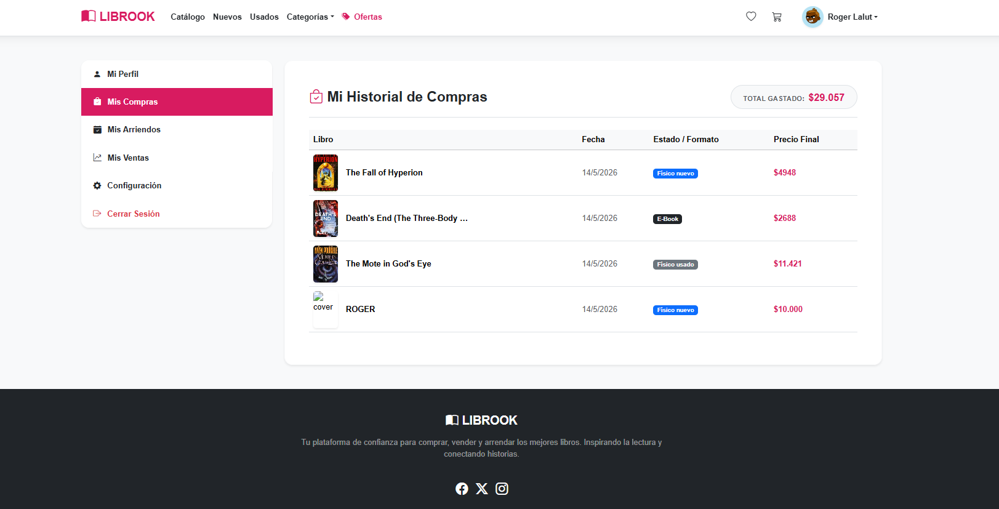

<div align="center">
  
  <h1>📚 LIBROOK</h1>
  <p><strong>El Marketplace Híbrido Definitivo para Libros Físicos y Digitales</strong></p>

  <p>
    
    
    
    
  </p>
</div>

<hr />

## 🌟 Sobre el Proyecto

**LIBROOK** es una plataforma de e-commerce moderna desarrollada en React que permite a los usuarios descubrir, comprar, arrendar y publicar libros. Destaca por su arquitectura híbrida que maneja inventarios físicos (con control de stock y desgaste) junto a descargas digitales (E-Books).

Con un diseño enfocado en la experiencia del usuario (UI/UX) y un robusto panel de control personal, LIBROOK se posiciona como una solución completa para comunidades literarias.

---

## 🚀 Funcionalidades Principales

- 🛍️ **Marketplace Dual:** Soporte para comprar E-Books digitales o comprar/arrendar libros físicos.
- 🔐 **Autenticación Segura:** Sistema de Registro y Login con doble validación (contraseñas seguras, sanitización Anti-XSS).
- 🎭 **Avatares Dinámicos:** Generación de avatares interactivos en tiempo real basados en el nombre del usuario.
- 📊 **Panel de Control (Dashboard):** Historial de compras, libros arrendados, gestión de favoritos y un **rastreador de ingresos** para libros vendidos.
- 📦 **Sistema de Publicación:** Cualquier usuario puede convertirse en vendedor, publicando sus propios libros en el catálogo global.
- 🔎 **Motor de Búsqueda:** Filtros acumulativos (Nuevos, Usados, Digitales), ordenamiento por precio y paginación progresiva optimizada.
- 💬 **Reseñas y Calificaciones:** Sistema de feedback con protección contra inyección de código.

---

## 💻 Tecnologías Utilizadas

### Frontend & UI

- **React.js** (Librería principal)
- **Vite** (Empaquetador ultrarrápido)
- **React Router DOM v6** (Navegación SPA)
- **Bootstrap 5** (Framework CSS base)
- **CSS Vanilla** (Glassmorphism, animaciones y colorimetría Magenta/Amarillo)
- **React Hot Toast** (Notificaciones modernas)

### APIs e Integraciones

- **OpenLibrary API:** Consumo de catálogo público global de libros.
- **DiceBear API:** Generación procedural de avatares en 5 estilos diferentes (_Adventurer, Bottts, Pixel-Art, etc._).

---

## 🤖 Inteligencia Artificial Utilizada

El desarrollo de este proyecto fue impulsado y arquitectado en colaboración con **Antigravity**, un asistente de IA avanzado especializado en _Agentic Coding_ diseñado por **Google DeepMind**.
La IA fue clave para:

- Implementar algoritmos de seguridad (Prevención XSS y validaciones dinámicas).
- Diseñar la lógica del `Context API` para un carrito de compras unificado (compra/arriendo).
- Construir interfaces modernas (Glassmorphism) y optimizar el rendimiento de renderizado en React.
- ChatGPT fue utilizado para generar ideas, refinar el código y ayudar con la documentación.

---

## 📸 Capturas de Pantalla

_(Reemplaza estas URLs locales por las imágenes reales de tu proyecto)_

| Catálogo Principal | Panel de Usuario (Dashboard) |



| Selector de Avatares | Detalle y Compra |



---

## ⚙️ Cómo Ejecutar el Proyecto Localmente

Sigue estos pasos para correr LIBROOK en tu propia máquina:

### 1. Pre-requisitos

Asegúrate de tener instalado [Node.js](https://nodejs.org/) (versión 16.x o superior).

### 2. Clonar el repositorio

```bash
git clone https://github.com/RogerLalut/LIBROOK.git
cd LIBROOK
```

### 3. Instalar dependencias

Usando NPM:

```bash
npm install
```

### 4. Iniciar el servidor de desarrollo

```bash
npm run dev
```

### 5. Ver la aplicación

Abre tu navegador y navega a la URL que indica la terminal (por lo general, `http://localhost:5173`).

---

## 🛡️ Aspectos de Seguridad

Este proyecto implementa buenas prácticas de seguridad Frontend:

- **Sanitización de Inputs:** Función centralizada que intercepta y neutraliza inyecciones HTML y Scripts (`<script>`).
- **Manejo de Errores Robustos:** `Try/Catch` en peticiones HTTP, _timeouts_ de 20 segundos para evitar fugas de memoria y bloqueos UI.
- **Validación Bootstrap:** Retroalimentación visual inmediata antes de enviar formularios a la lógica de negocio.

---

<div align="center">
  <p>Construido con ❤️ y React</p>
</div>
